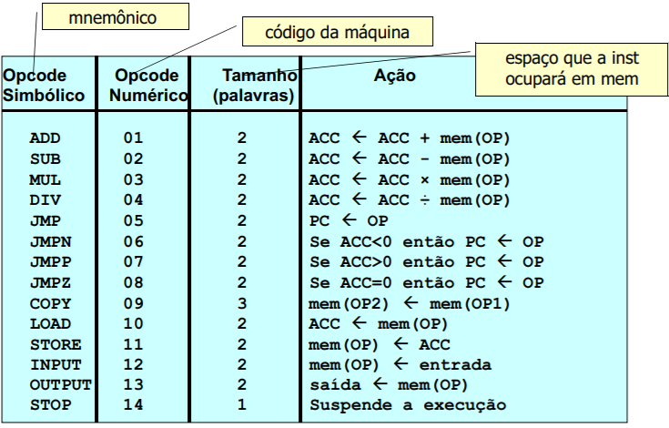

# System Software

This repository addresses the code for the System Software (or "Software de Sistema", "Software Básico" in portuguese).

In the first project (proj-1 branch), the goal is to create an assembler for a custom instruction set. There are 14 possible instructions, and for the first project there's no linker and therefore different modules are not supported. For the first project, it's also implemented a simulator to run the generated object code.

For the second project (main branch), the goal is to open the possibility for modular code, and create a linker.



## Assembler

The assembler uses the table above to interpret the given .asm file and generate an .obj file.

The assembly language uses an accumulator to perform operations, and accepts the *SPACE* and *CONST* directives.

Labels are limited on 50 characters, and follow the C language rules. 

Data and text sections are separated by the *SECTION DATA* and *SECTION TEXT* directives, and the data section should always be above the text section.

It's also worth mentioning that the custom assembly language is not case sensitive, ignores unecessary spaces or line breaks, and comments are made using the ";" character. 

Here's an example of the assembly code:

```
SECTION DATA
N1: SPACE
N2: CONST 5

SECTION TEXT
ROT: INPUT N1
LOAD N1
ADD N2
STORE N1
OUTPUT N1
STOP
```

You may compile and run it using the following command:

```
g++ -o assembler src/montador.cpp
./assembler examples/prog1.asm
```

The output for the code above should be the *prog1.obj* file to be used by the linker, with the following content:

```
H examples/prog1
S 13
R 0101010101000
T 12 11 
T 10 11 
T 1 12 
T 11 11 
T 13 11 
T 14 
T 0 
T 5 
```

H = headers,
S = code size,
R = relocation data,
T = text (code)

## Linker and modularization

In order to use different modules, you should use the *PUBLIC* and *EXTERN* directives inside the data section. It supports up to 3 different files simultaneously.

As for the linker, it also receives up to 3 different object files, links them and generates a new object file named "firstfile_linked.obj", ready to be executed by the simulator.

You may compile and run it using the following command:

```
g++ -o linker src/ligador.cpp
./linker examples/prog1_linked.obj
```

## Simulator

The simulator receives and .obj file as input, and then runs it.

It shows on the stdout the current program counter value, and the current accumulator value.

You may compile and run it using the following command:

```
g++ -o simulator src/simulador.cpp
./simulator examples/prog1_linked.obj
```

The output for the provided code and "5" as input should be:

```
PC : 2
ACC : 0

PC : 4
ACC : 5

PC : 6
ACC : 10

PC : 8
ACC : 10

PC : 10
ACC : 10
OUTPUT: 10

PC : 11
ACC : 10
```

And it generates a new file called "prog1_linnked.out" if there's any output requested by the *OUTPUT* instruction. For the example code, the output is "10".